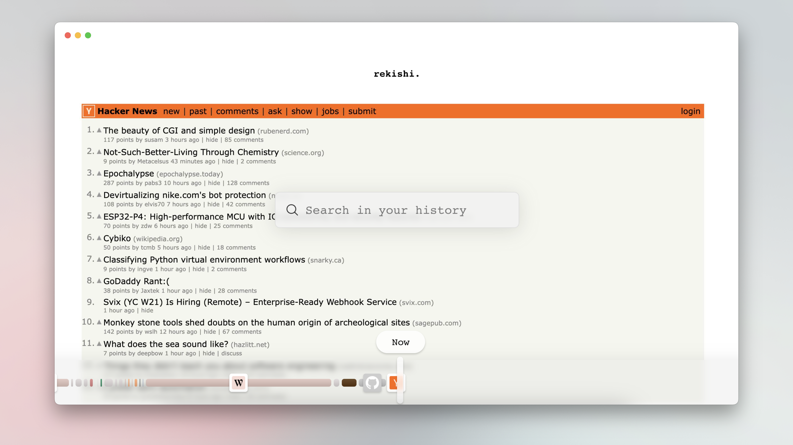

__rekishi__ brings a [rewind.ai](https://www.rewind.ai/) like experience right to your browser!

🕝 Visually scroll through your browsing session

🔎 Search your history and see previews of the results

🔒 Everything is stored on your device

### Local Installation

1. Run `npm i`
2. Run `npm run build`
3. Load Extension on Chrome
   1. Open - Chrome browser
   2. Access - chrome://extensions
   3. Check - Developer mode
   4. Find - Load unpacked extension
   5. Select - `dist` folder
